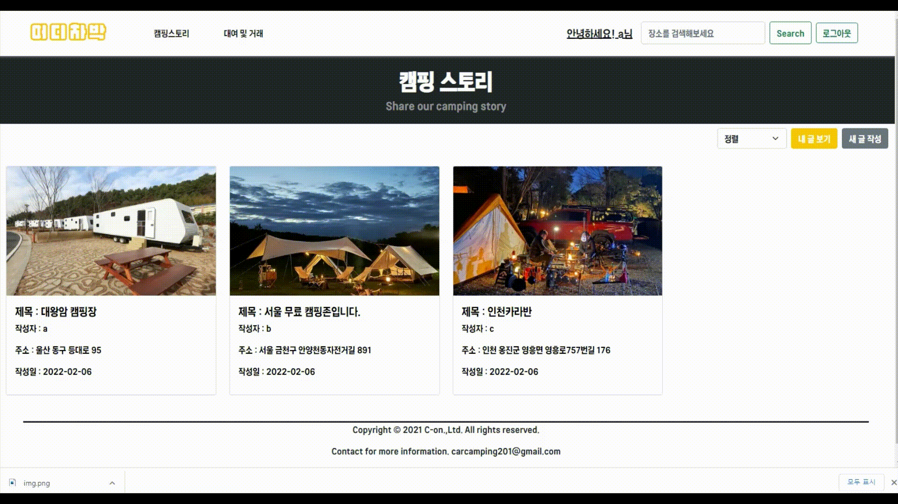

# 개요

최근 **차박 캠핑의 유행**으로 캠핑용품, SUV차량 판매율이 증가하고 있다. 차박캠핑은 모임이 제한된 코로나 시대에 혼자 또는 소수의 사람들이 함께 즐길 수 있는 정말 좋은 취미 활동이다.

하지만 진입장벽이 높아서 쉽사리 도전하기가 어렵다. 장소를 찾는것과 준비해야 할 것들을 초보자는 파악하기 어렵고, 필수적인 캠핑용품들을 구비하기엔 가격 부담이 크기 때문이다.

이러한 이유로 차박 캠핑의 입문 장벽을 낮춰주기 위한 플랫폼 **어디차박**을 만들게 되었다.

> 💡 **어디차박 기능**
>
> - 차박 장소, 사진, 캠핑장 가격 등의 **정보를 공유**한다.
> - **캠핑 용품을 대여 및 판매**할 수 있는 디지털 서비스를 제공한다.

 

# 서비스 구조

#### ✅ 스토리 게시물 생성

 

#### ✅ 스토리 게시물 좋아요, 정렬

 

#### ✅ 거래 게시물 연락처 열람 요청

 

# 설계

## 👉 Database

#### ✅ ERD

 

## 👉BackEnd

#### ✅ API SPEC

[/auth/\* API](./spec/Backend/api/auth)  

[/stroy/\* API](./spec/Backend/api/story) 

[/shop/\* API](./spec/Backend/api/shop) 

[/taglist/\* API](./spec/Backend/api/taglist_API.md)

 

## 👉FrontEnd

#### ✅ client Logic Flow (리팩토링 전)

click!

#### ✅ client class 관계 (리팩토링\_1)

click!

_(주입 클래스) → (주입받는 클래스)_

- **navigate**

  HttpClient, navbarAuthComponent → Navigator

- **login**

  HttpClient, LoginFormComponent, LoginStateComponent → Login

- **signup**

  HttpClient, JoinComponent → Join

- **shop.detail**

  HttpClient , ShopDataComponent, ShopReplyComponent → ShopDetail

- **story.detail**

  StroyHeart, StoryComponent → StoryDetail

