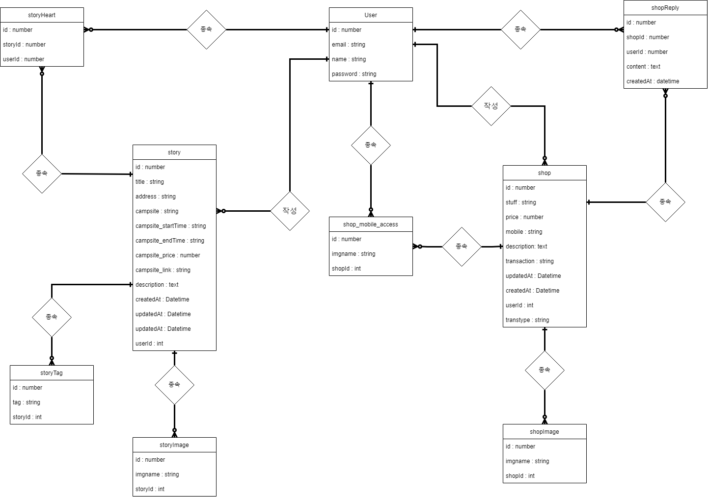

# 개요

성능, 안전, 가성비 등 많은 부분이 부족한 캐스퍼, 레이같은 소형 SUV나 박스형 자동차가 유행하고 있다. 최근 **차박 캠핑** 이 떠오르면서 생긴 현상이다.

그렇지만 여전히 캠핑입문자는 진입 장벽이 높아 차박캠핑을 도전하기가 쉽지않다. 차박이 가능한 장소를 찾는 것부터 용품 구비, 캠핑 방법 등 많은 어려움이 있기 때문이다.

그래서 차박 캠핑의 입문 장벽을 낮춰주기 위한 플랫폼을 만들게 되었다.

이 플랫폼은 캠퍼들이 캠핑 장소, 사진 등의 **_정보를 공유_** 하고 **_캠핑 용품을 대여 및 판매_** 할 수 있는 디지털 서비스를 제공한다.

 

# 서비스 구조

....

 

# 설계

## 👉 Database

#### ✅ ERD

 

## 👉BackEnd

#### ✅ API SPEC

[/auth API](./spec/Backend/api/auth_API.md)  

[/stroy API](./spec/Backend/api/story_API.md) 

[/stroy/heart API](./spec/Backend/api/story.heart_API.md) 

[/shop API](./spec/Backend/api/shop_API.md) 

[/shop/mobile API](./spec/Backend/api/shop.mobile_API.md) 

[/shop/reply API](./spec/Backend/api/shop.reply_API.md) 

[/taglist API](./spec/Backend/api/taglist_API.md)

 

## 👉FrontEnd

#### ✅ Logic Flow

